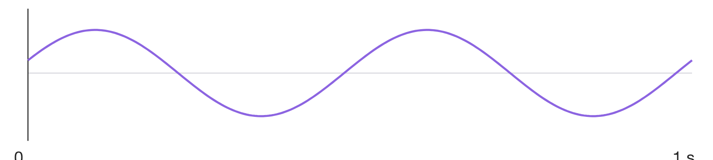

姓名：________　班级：________

## Q3 怎样留下波形随时间的变化？
这一秒的曲线怎样记录？
在纸上圈出你准备读取的时刻。

{width=95%}

我的记录／算式：____________________________

我的解释与依据：____________________________

## Q5 样本值不在可选等级上，怎么办？
四个样本：−0.62、−0.10、0.38、0.84。
只能用：−0.75、−0.25、0.25、0.75近似。
分别选哪个？

|样本值|近似值|Q6码字（学到编码后填写）|
|---|---|---|
|−0.62|________|________|
|−0.10|________|________|
|0.38|________|________|
|0.84|________|________|
我的记录／算式：____________________________

我的解释与依据：____________________________

## Q6 四个量化等级，怎样写成码字？
从低到高编号0、1、2、3；采用等长二进制码。
每个样本至少几bit？写出四个码字。

填写上一表码字，再互读查回代表值。
我的记录／算式：____________________________

我的解释与依据：____________________________

## Q7 只有码字，就能按原速播放吗？
只有四个已编码样本，能确定播放时长吗？课堂短口答并记依据；画时间轴留作课后拓展。

我的记录／算式：____________________________

我的解释与依据：____________________________

## T1 总结与证据
用Q3圈点、Q5近似、Q6互读或Q7时长举证，再用一句话说清每一步。
我的总结：____________________________
依据：____________________________
