<!--
Before rendering for the first time:

python scripts/prepare-source-images.py

This deck intentionally uses the original classroom screenshots as the visual baseline.
It is not yet the native Quarto reconstruction.
-->

## 原课截图 1 {.source-slide}

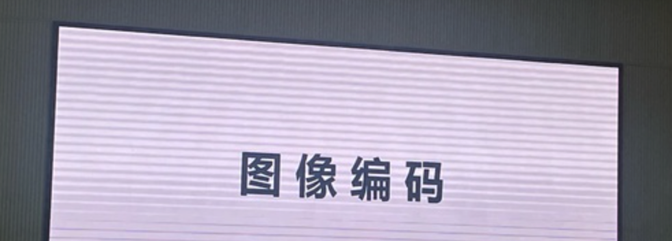{fig-alt="原课截图 1：图像编码标题页"}

Snip20260929_1.png

::: {.notes}
课程开场。承接之前的字符编码学习，转入图像这一类数据。
:::

---

## 原课截图 2 {.source-slide}

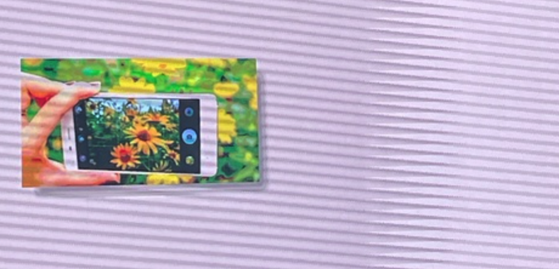{fig-alt="原课截图 2：拍摄花朵的生活情境"}

Snip20260929_2.png

::: {.notes}
约 00:00:43。用日常拍照情境进入问题：照片拍下来以后，如果不断放大会怎样？
:::

---

## 原课截图 3 {.source-slide}

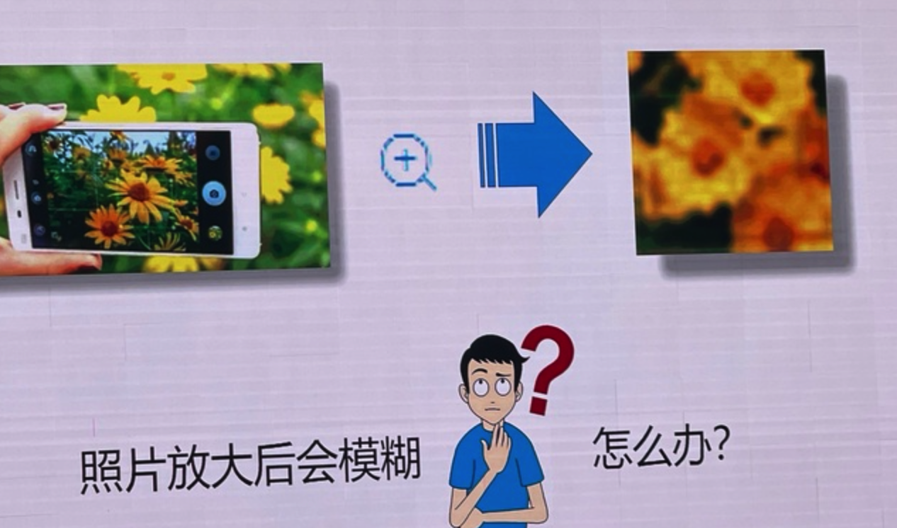{fig-alt="原课截图 3：照片放大后会模糊怎么办"}

Snip20260929_3.png

::: {.notes}
提出本课最初问题：照片放大以后变模糊，怎么办？先让学生基于生活经验回答。
:::

---

## 原课截图 4 {.source-slide}

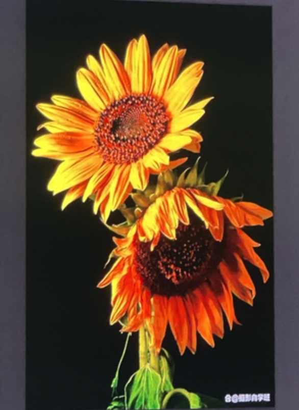{fig-alt="原课截图 4：向日葵原始照片"}

Snip20260929_4.png

::: {.notes}
约 00:01:20。教师现场打开照片，开始连续放大。
:::

---

## 原课截图 5 {.source-slide}

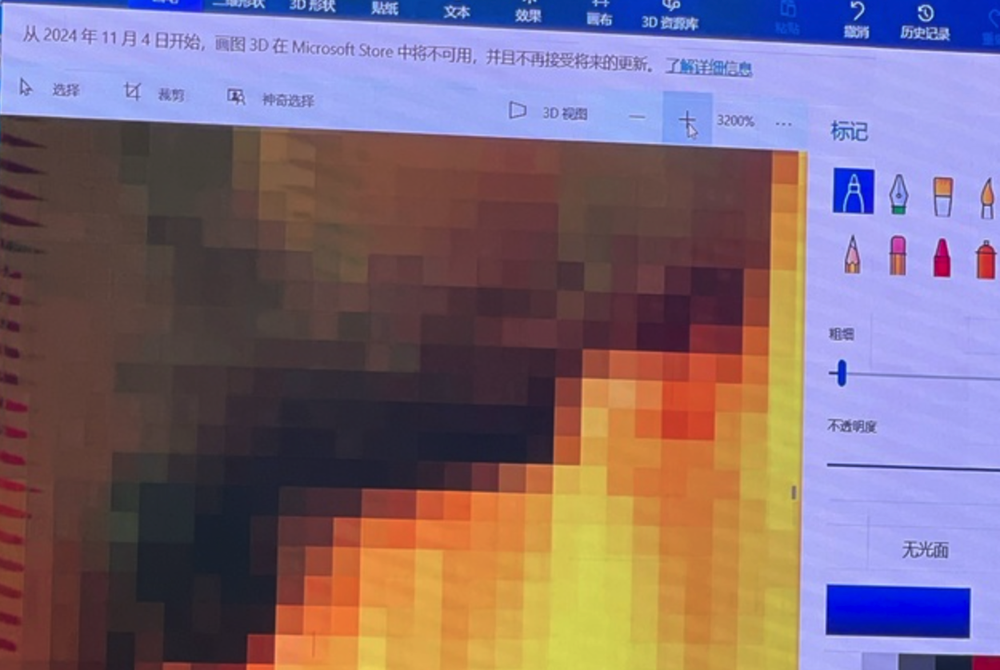{fig-alt="原课截图 5：高倍放大后看到像素色块"}

Snip20260929_5.png

::: {.notes}
放大到能够看见一个个纯色小方块。追问这些小方块是什么，引出“像素”。
:::

---

## 原课截图 6 {.source-slide}

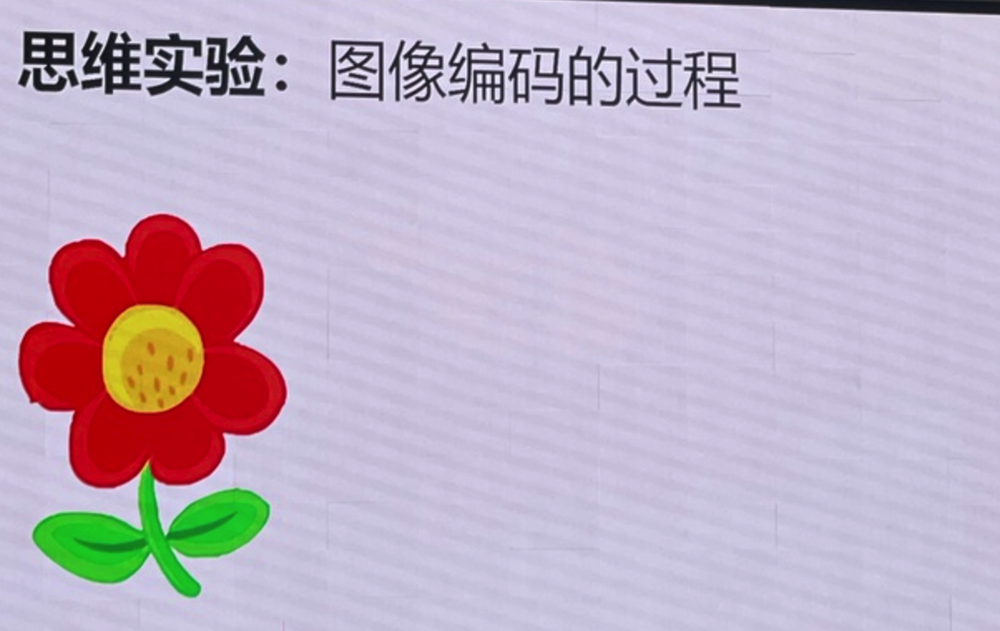{fig-alt="原课截图 6：思维实验 图像编码的过程"}

Snip20260929_6.png

::: {.notes}
约 00:02:48。进入思想实验：像素是怎么来的？以自然界中的一朵花为对象。
:::

---

## 原课截图 7 {.source-slide}

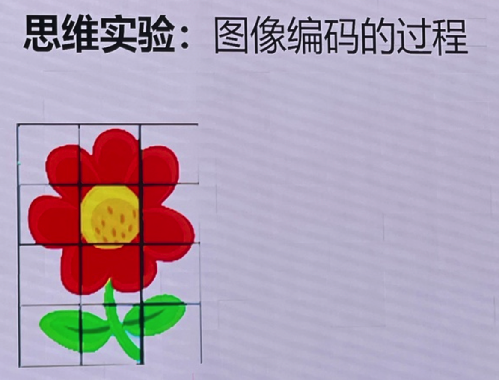{fig-alt="原课截图 7：花朵与 3×4 网格"}

Snip20260929_7.png

::: {.notes}
从光的反射与相机光敏元件讲起。设定横向 3 个、纵向 4 个采样位置，共 12 个样本点。
:::

---

## 原课截图 8 {.source-slide}

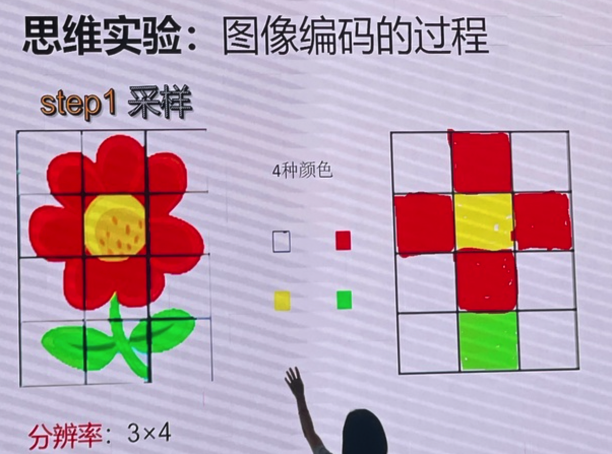{fig-alt="原课截图 8：step1 采样与 3×4 四色像素图"}

Snip20260929_8.png

::: {.notes}
约 00:06:12 起。命名“采样”，引入 3×4 分辨率；随后用四种颜色近似各网格。
:::

---

## 原课截图 9 {.source-slide}

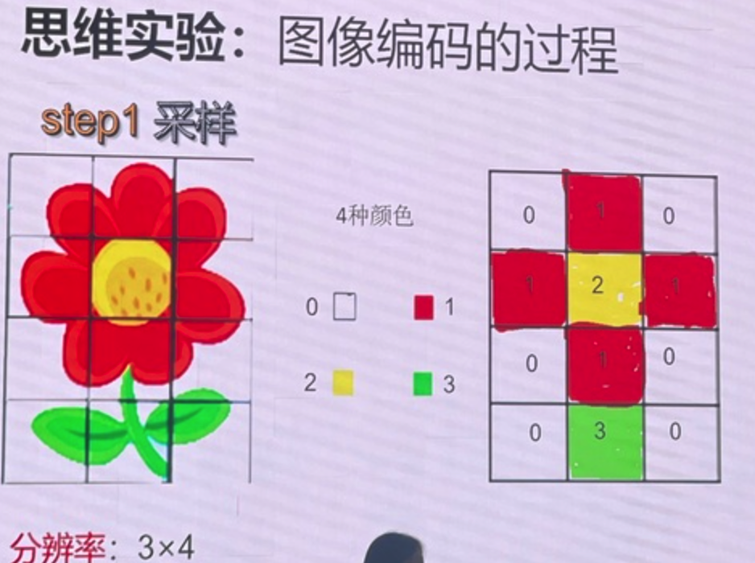{fig-alt="原课截图 9：四种颜色编号 0 1 2 3"}

Snip20260929_9.png

::: {.notes}
约 00:07:51。把白、红、黄、绿分别编号 0、1、2、3，用有限整数描述样本，命名为“量化”。
:::

---

## 原课截图 10 {.source-slide}

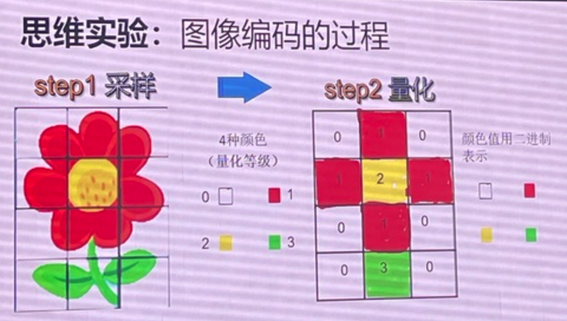{fig-alt="原课截图 10：采样与量化组合页"}

Snip20260929_10.png

::: {.notes}
过渡到二进制编码。核心追问：四种颜色需要几个二进制位？注意学生曾把 12 个采样点与 4 种颜色状态混淆。
:::

---

## 原课截图 11 {.source-slide}

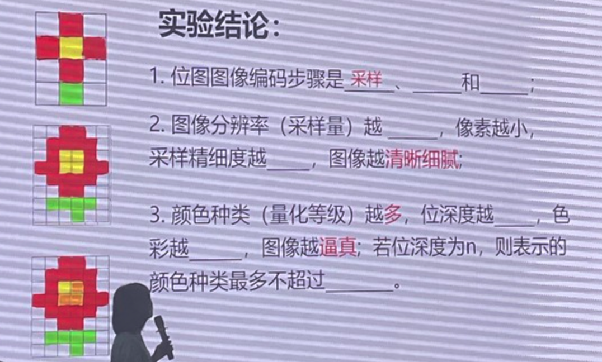{fig-alt="原课截图 11：三轮花朵思想实验比较"}

Snip20260929_11.png

::: {.notes}
覆盖约 00:14:46–00:20:35 的三轮比较：3×4→6×8 提高分辨率；再保持分辨率、增加颜色数，使位深度由 2 变 3。
:::

---

## 原课截图 13 {.source-slide}

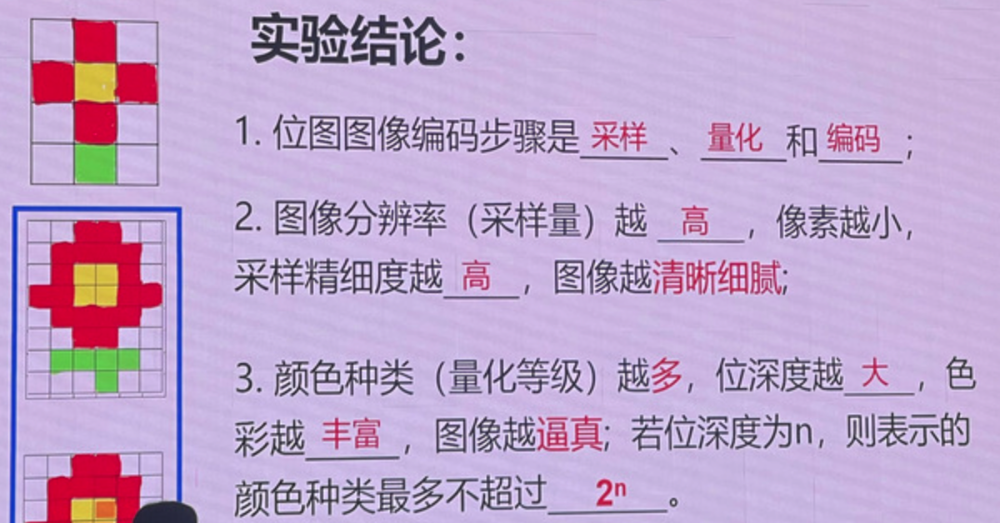{fig-alt="原课截图 13：实验结论"}

Snip20260929_13.png（源文件无编号 12）

::: {.notes}
约 00:20:37。学生拿出学案，跟随教师填写四条核心结论：采样—量化—编码；分辨率；颜色数与位深度；2^n。
:::

---

## 原课截图 14 {.source-slide}

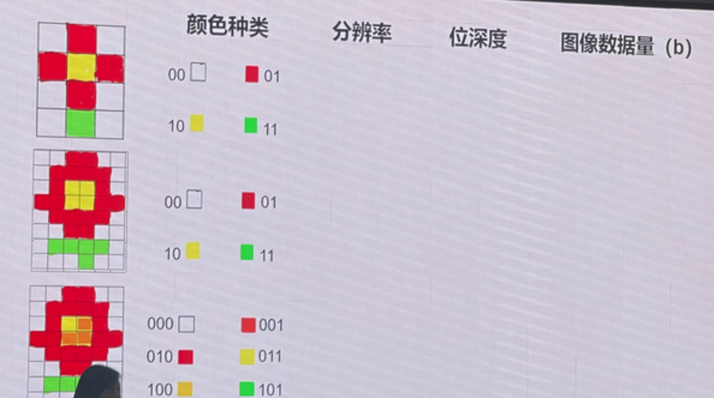{fig-alt="原课截图 14：三幅实验图与图像数据量表格"}

Snip20260929_14.png

::: {.notes}
约 00:22:29。转入存储量问题：为什么同一场景的照片可能从几百 KB 到几 MB？开始比较三幅实验图。
:::

---

## 原课截图 15 {.source-slide}

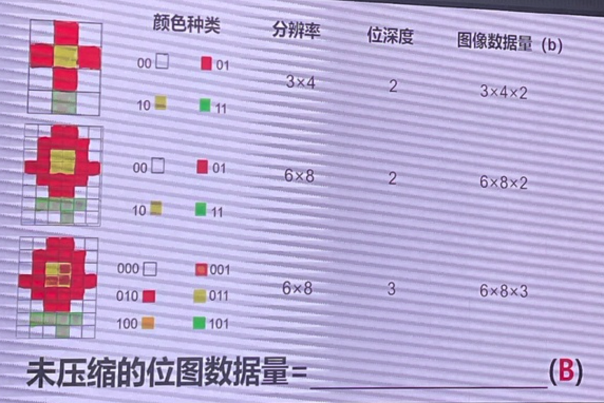{fig-alt="原课截图 15：图像数据量逐步推导"}

Snip20260929_15.png

::: {.notes}
逐项得到 3×4×2、6×8×2、6×8×3，总结“像素总数 × 每像素位数”。
:::

---

## 原课截图 16 {.source-slide}

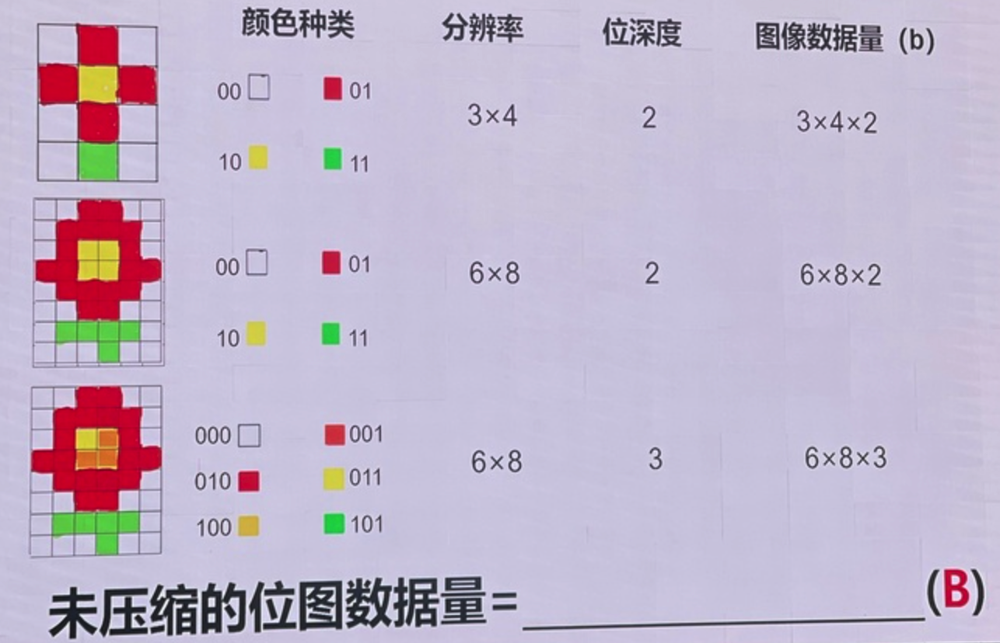{fig-alt="原课截图 16：未压缩位图数据量公式"}

Snip20260929_16.png

::: {.notes}
约 00:25:14。由 bit 转 Byte，需要再除以 8；随后补充 KB、MB 的 1024 换算。
:::

---

## 原课截图 17 {.source-slide}

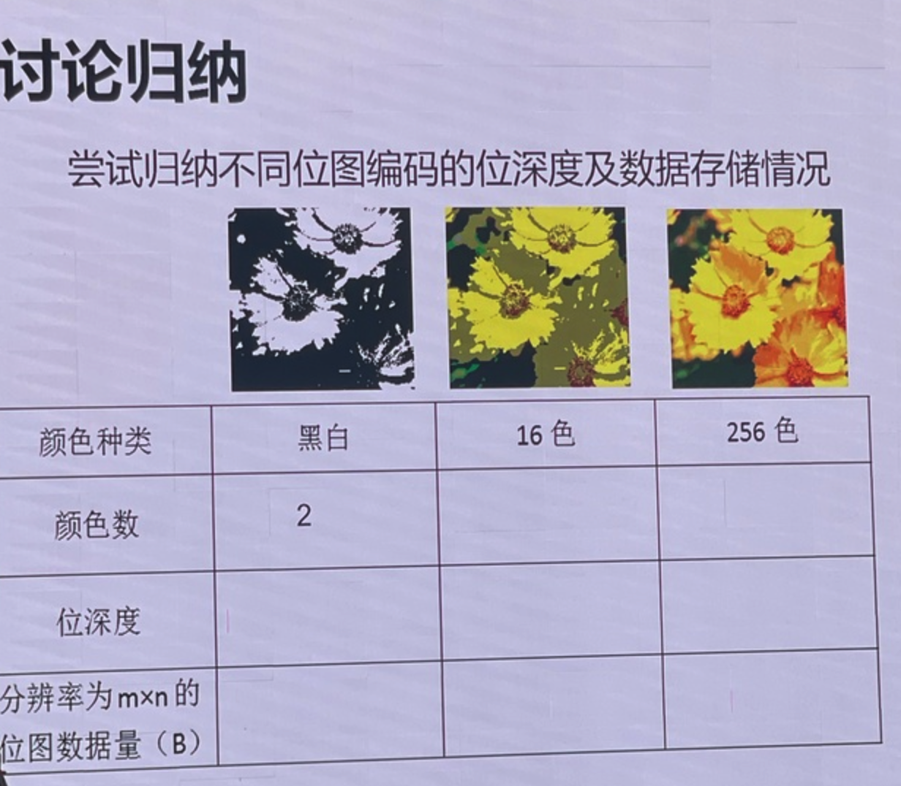{fig-alt="原课截图 17：黑白 16色 256色 24位讨论归纳表"}

Snip20260929_17.png

::: {.notes}
约 00:26:28。进入举一反三：根据颜色数推位深度，再代入数据量公式。
:::

---

## 原课截图 18 {.source-slide}

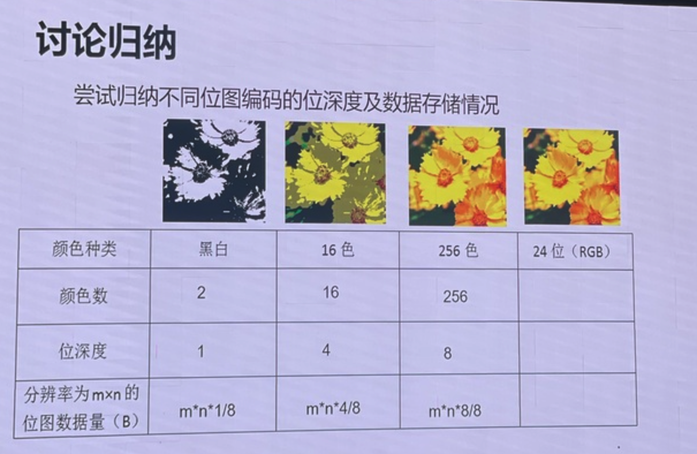{fig-alt="原课截图 18：讨论归纳表答案与真彩色"}

Snip20260929_18.png

::: {.notes}
完成黑白、16 色、256 色，并过渡到 24 位真彩色。
:::

---

## 原课截图 19 {.source-slide}

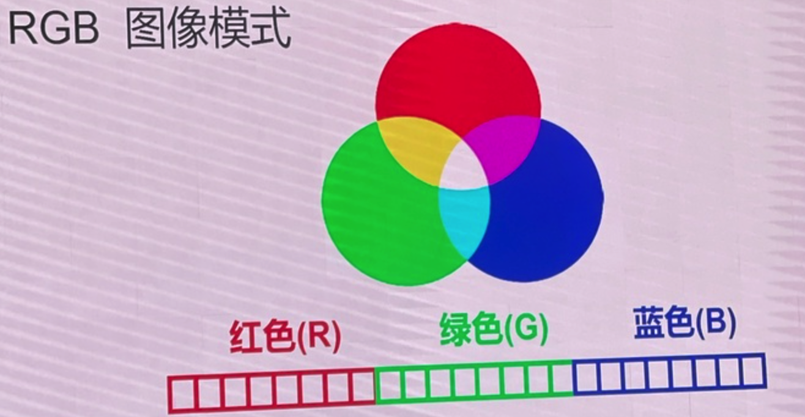{fig-alt="原课截图 19：RGB 图像模式与三个 8-bit 通道"}

Snip20260929_19.png

::: {.notes}
约 00:28:25。RGB 分别是红、绿、蓝；每个通道 8 bit，共 24 bit，可组合出 2^24 种颜色。
:::

---

## 原课截图 20 {.source-slide}

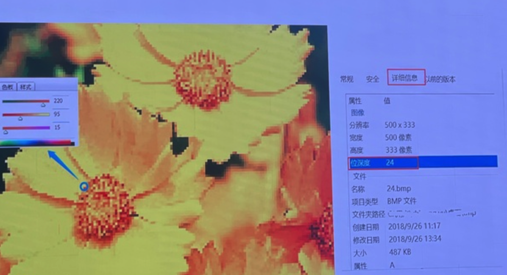{fig-alt="原课截图 20：单个像素的 RGB 数值"}

Snip20260929_20.png

::: {.notes}
约 00:30:06。通过图像软件观察单个像素的 RGB 十进制值，再说明计算机内部以二进制保存三个通道数据。
:::

---

## 原课截图 21 {.source-slide}

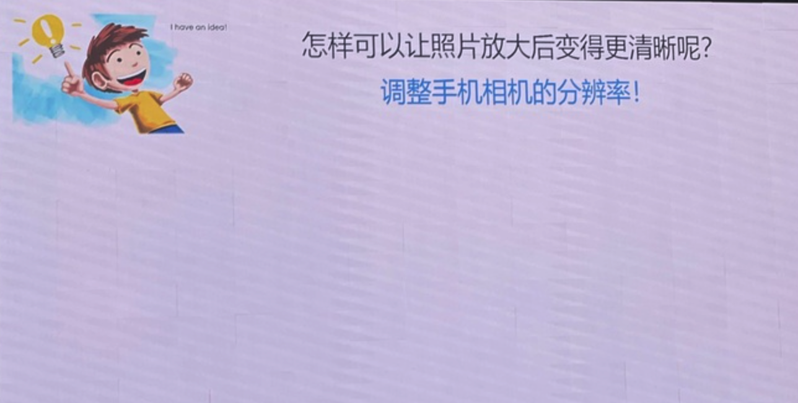{fig-alt="原课截图 21：提高相机分辨率让图片放大后更清晰"}

Snip20260929_21.png

::: {.notes}
约 00:33:09。回到开头的问题：位图由有限像素组成，放大不会凭空产生原始细节；原教师建议拍摄时提高分辨率。
:::

---

## 原课截图 22 {.source-slide}

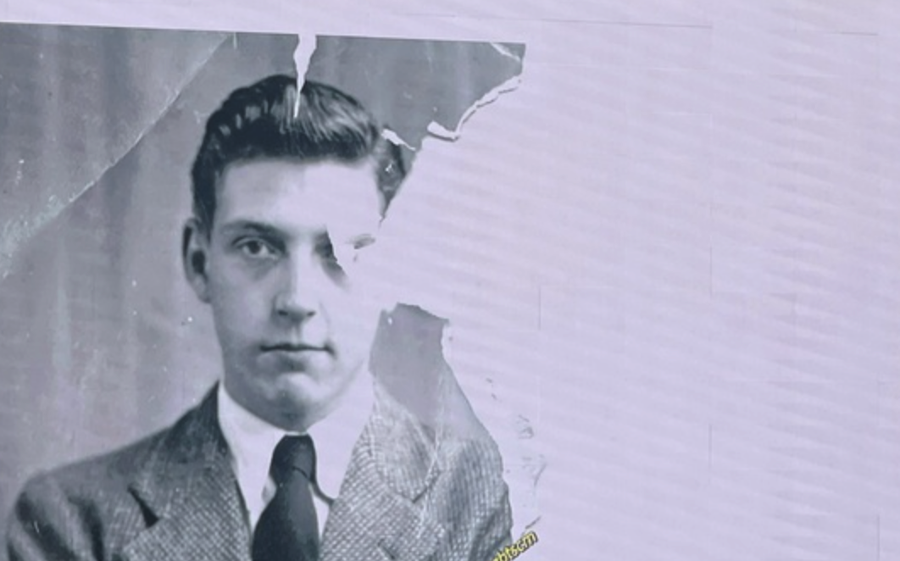{fig-alt="原课截图 22：破损照片"}

Snip20260929_22.png

::: {.notes}
约 00:33:39。展示破损照片，询问能否修复，学生提出 AI 修复。
:::

---

## 原课截图 23 {.source-slide}

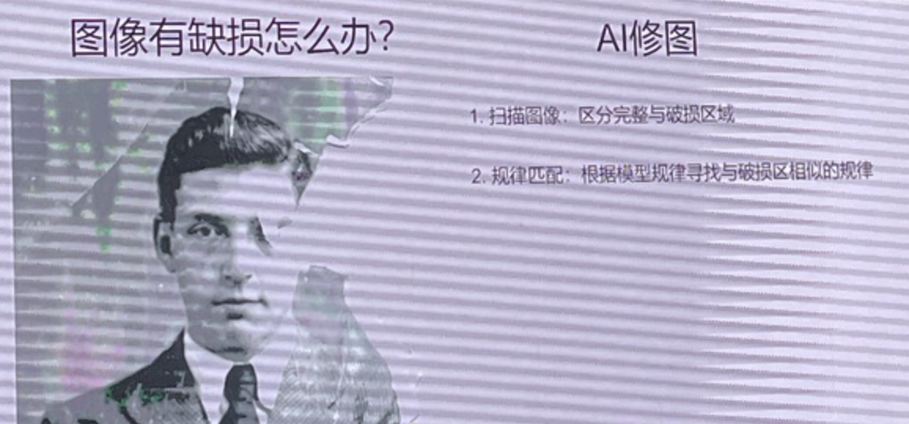{fig-alt="原课截图 23：AI 修图引导"}

Snip20260929_23.png

::: {.notes}
让学生猜测 AI 怎样修复。保留学生根据周围内容、变化规律进行推测的课堂过程。
:::

---

## 原课截图 24 {.source-slide}

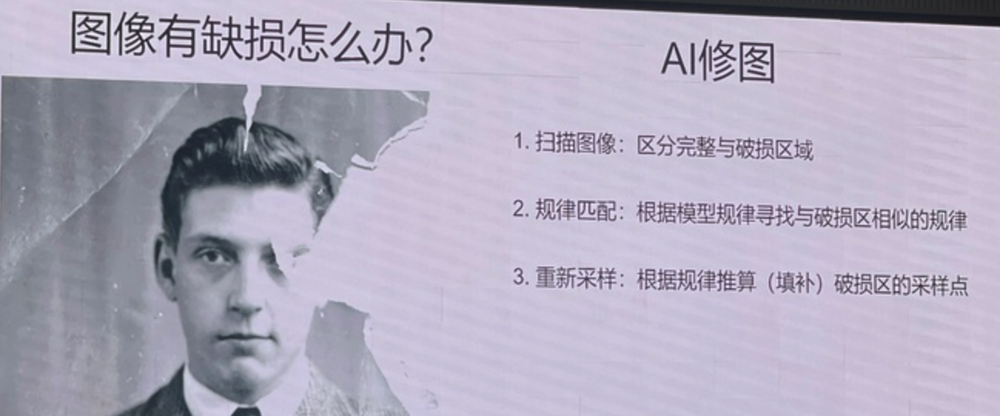{fig-alt="原课截图 24：AI 修图四步解释"}

Snip20260929_24.png

::: {.notes}
原课简化模型：扫描识别 → 规律匹配 → 重新采样 → 重新量化、编码。此处只做原课复刻，不作为最终技术定义。
:::

---

## 原课截图 25 {.source-slide}

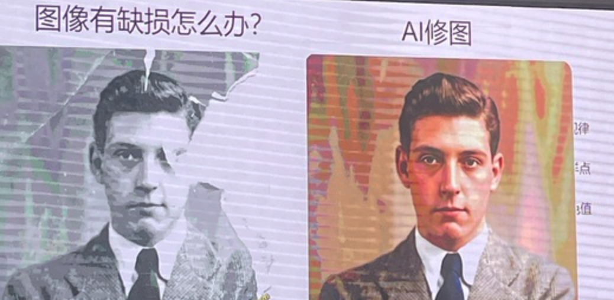{fig-alt="原课截图 25：破损照片与 AI 修复结果"}

Snip20260929_25.png

::: {.notes}
约 00:36:20。展示修复后的结果，教师再次把修复过程连接回本节的图像编码模型。
:::

---

## 原课截图 26 {.source-slide}

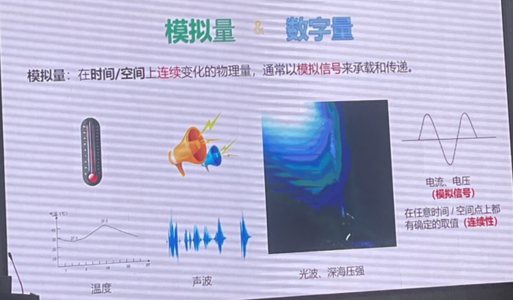{fig-alt="原课截图 26：模拟量与连续变化"}

Snip20260929_26.png

::: {.notes}
约 00:37:19。进入模拟量：温度、声音、压力、光照等作为连续变化例子，强调“连续”。
:::

---

## 原课截图 27 {.source-slide}

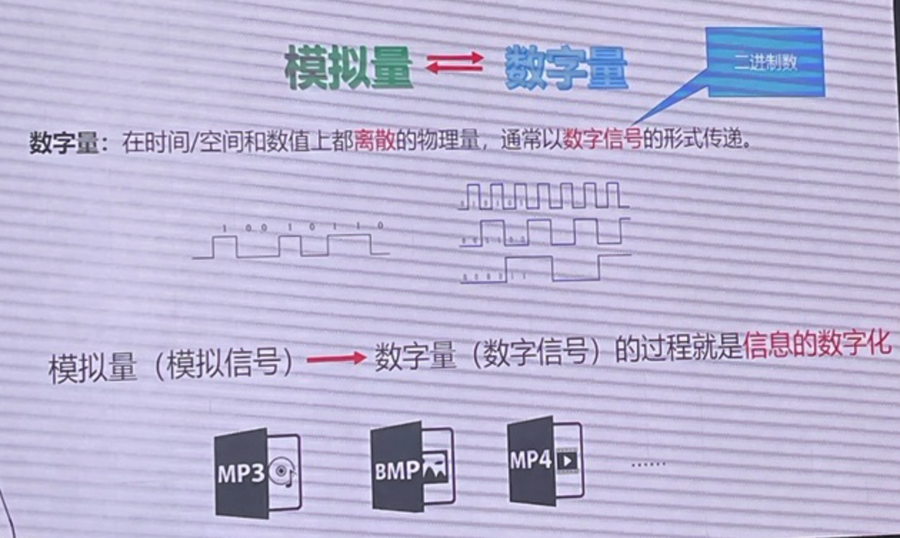{fig-alt="原课截图 27：数字量与 0 1 离散表示"}

Snip20260929_27.png

::: {.notes}
约 00:41:41。进入数字量：用 0/1 离散表示示意。最终收束：图像编码把自然界信息转成计算机可表示的数字量，即信息数字化。
:::
