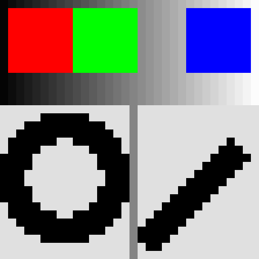
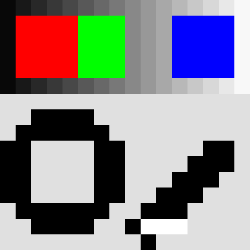
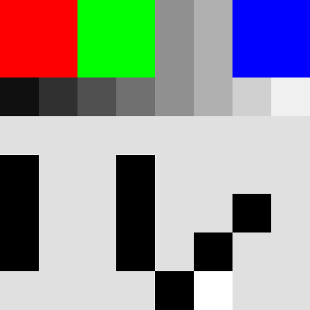
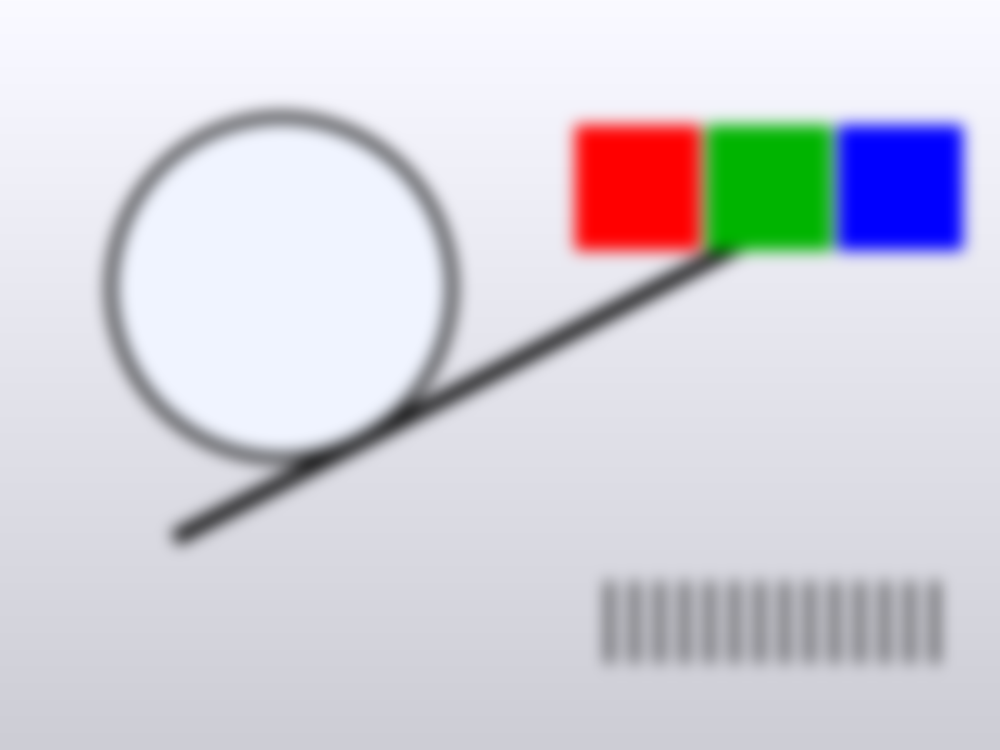
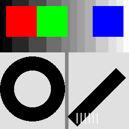

## 图像编码

Sampling · Quantization · Encoding

从一张图片到 pixels、colors、bits 和 bytes

---

## Q0 这四种说法分别在描述图像的哪一层？

请先排序，学完后再修改。

::: columns
::: {.column width="25%"}
**很多 0 和 1**
:::
::: {.column width="25%"}
**很多像素 / 小方格**
:::
::: {.column width="25%"}
**很多数字**
:::
::: {.column width="25%"}
**很多颜色值**
:::
:::

---

## Q1 如果显示尺寸一样，为什么这些图片看起来不同？

预测：哪一张保留最多细节？低像素数时最先丢失什么？

---

## Q1 如果显示尺寸一样，为什么这些图片看起来不同？

证据页 A：256 / 64 / 32

::: columns
::: {.column width="33%"}
{width=100%}

256×256
:::
::: {.column width="33%"}
{width=100%}

64×64
:::
::: {.column width="33%"}
{width=100%}

32×32
:::
:::

---

## Q1 如果显示尺寸一样，为什么这些图片看起来不同？

证据页 B：32 / 16 / 8

::: columns
::: {.column width="33%"}
{width=100%}

32×32
:::
::: {.column width="33%"}
{width=100%}

16×16
:::
::: {.column width="33%"}
{width=100%}

8×8
:::
:::

---

## Q1 如果显示尺寸一样，为什么这些图片看起来不同？

Sampling：在哪里取样？取多少个位置？

Resolution：本课中指宽 × 高的像素尺寸。

---

## Q2 分辨率越高，图像一定越清晰吗？

先判断：1600×1200 的图片一定比 800×600 更清晰吗？

---

## Q2 分辨率越高，图像一定越清晰吗？

::: columns
::: {.column width="50%"}
{width=100%}

1600×1200，Gaussian blur simulation
:::
::: {.column width="50%"}
{width=100%}

800×600，同场景，清晰
:::
:::

先观察：哪张更容易看清边缘和细节？

---

## Q2 分辨率越高，图像一定越清晰吗？

高 pixel count 不自动等于高质量。

在同一场景、同一范围、其他条件相同时，更多采样通常保留更多细节。

---

## Q3 像素数量完全一样，红绿接缝还会一直看得见吗？

条件：pixel dimensions 不变，只限制整幅图最多出现的颜色总数。

---

## Q3 像素数量完全一样，红绿接缝还会一直看得见吗？

先看图，不先公布 RGB 数值。

::: columns
::: {.column width="33%"}
{width=100%}

原图
:::
::: {.column width="33%"}
{width=100%}

最多 16 colors
:::
::: {.column width="33%"}
{width=100%}

最多 2 colors
:::
:::

---

## Q3 像素数量完全一样，红绿接缝还会一直看得见吗？

| 版本 | left (72,40) | right (73,40) | 是否相同 |
|---|---:|---:|---|
| 16 colors | (255, 0, 0) | (0, 255, 0) | 不同 |
| 2 colors | (71, 42, 71) | (71, 42, 71) | 相同 |

结论：pixel positions 没有减少，但视觉边界可能消失。

---

## Q4 如果只允许 16 种颜色，最少需要几 bit？

给 16 种颜色各分配一个不同的、固定长度的二进制标签。

2 bit、3 bit 够吗？怎样判断？

---

## Q4 如果只允许 16 种颜色，最少需要几 bit？

| bit 数 | 可表示状态数 |
|---:|---:|
| 1 | 2 |
| 2 | 4 |
| 3 | 8 |
| 4 | 16 |

$$\text{可表示状态数}=2^b$$

---

## Q5 “24-bit color” 是 24 种颜色吗？

先投票：A. 24 种　B. 256 种　C. $2^{24}$ 种　D. 现在还不能确定

---

## Q5 “24-bit color” 是 24 种颜色吗？

R: 8 bits → 0..255  
G: 8 bits → 0..255  
B: 8 bits → 0..255

$$8+8+8=24\text{ bits/pixel}$$

$$256^3=2^{24}=16{,}777{,}216$$

---

## Q6 一个 RGB 像素怎样变成 0 和 1？

RGB = (255, 128, 0)

先预测：255、128、0 的 8-bit binary 分别是什么？

---

## Q6 一个 RGB 像素怎样变成 0 和 1？

| 通道 | 十进制 | 8-bit binary |
|---|---:|---|
| R | 255 | 11111111 |
| G | 128 | 10000000 |
| B | 0 | 00000000 |

Encoding：把量化后的数值按约定表示并组织成 bits / bytes。

---

## Q7 真实 BMP 文件中，像素数据之前有什么？

真实文件：`assets/q7-3x2-24bit.bmp`

问题：pixel data 之前为什么还有一段 bytes？

---

## Q7 真实 BMP 文件中，像素数据之前有什么？

```text
42 4D  →  "BM"

header bytes at 0x0A:
36 00 00 00
↓
pixel-data offset = 54 bytes
```

pixel values ≠ whole image file

---

## Q8 1920×1080、24-bit RGB，不压缩需要多大？

A. 约 2 MB  
B. 约 6 MB  
C. 约 24 MB  
D. 约 48 MB

---

## Q8 1920×1080、24-bit RGB，不压缩需要多大？

$$1920\times1080=2{,}073{,}600\text{ pixels}$$

$$24\text{ bits/pixel}=3\text{ bytes/pixel}$$

$$2{,}073{,}600\times3=6{,}220{,}800\text{ bytes}\approx6.22\text{ MB}$$

答案：B. 约 6 MB

---

## Q9 宽和高都变成 2 倍，数据量变成几倍？

原图：800×600  
新图：1600×1200  
bits per pixel 不变

---

## Q9 宽和高都变成 2 倍，数据量变成几倍？

$$\frac{1600\times1200}{800\times600}=4$$

宽 ×2，高 ×2，所以像素总数 ×4。

---

## Q12 回看 Q0：这四种说法现在怎样排序？

::: columns
::: {.column width="25%"}
**很多 0 和 1**
:::
::: {.column width="25%"}
**很多像素 / 小方格**
:::
::: {.column width="25%"}
**很多数字**
:::
::: {.column width="25%"}
**很多颜色值**
:::
:::

---

## Q12 回看 Q0：这四种说法现在怎样排序？

像素位置 → 颜色值 → 数字表示 → bits / bytes

Sampling → Quantization → Encoding

$$\text{像素值数据量}=W\times H\times b\text{ bits}$$

本课 24-bit RGB：

$$W\times H\times3\text{ bytes}$$
