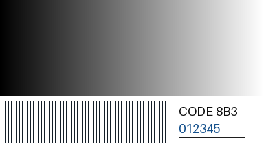
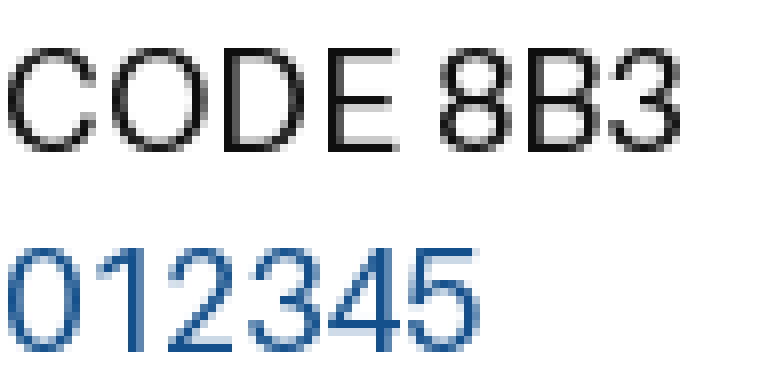
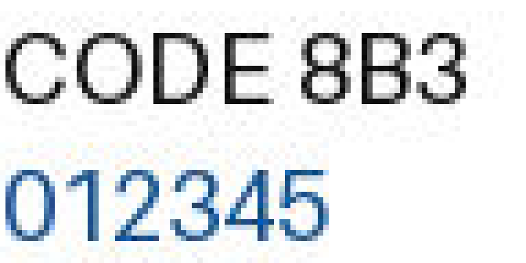
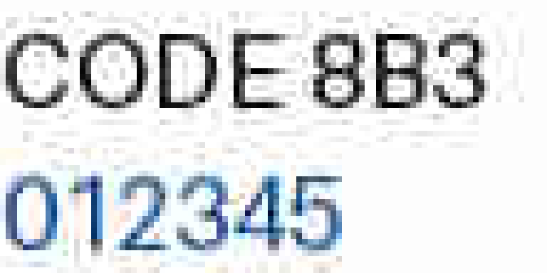

# C0 对象、课时与本文件的角色

高中信息科技，计划45分钟。学生已学过bit／byte、二进制编码、图像像素和音频样本，知道“数据需要按约定解释”。不要求会写Python，不要求掌握熵、Huffman树、DCT或频域分析。若此前尚未学习图像／音频编码，用灰度格和短声音介绍观察对象，不另讲采样定理。

默认教师使用Windows、WPS和JupyterLab，学生用纸笔参与。教师在预测后运行演示，学生负责提出方案、核对还原结果和判断用途。课时与设备条件是备课假设，尚未经本班试讲。

本文件为教学设计依据，回答问题链、活动、演示证据、揭示顺序和技术边界。本阶段完成设计及计算原型核查；PPTX、教师／学生Notebook、动画、活动单和完整媒体包为后续制作内容。本文件不是学生阅读材料，不能整页投影。

沿用用户指定的目录名`1-2-4-data-compresson`。所有本课材料放在本目录。后续PPTX依照项目`slide-style-guide.md`，每个Q先给独立问题页，再复制原页增加证据；问题的文字、字号和位置保持不变。内部Q／D／A编号只用于教师导航。每张教学页备注以完整问题或页面目的开始，并保留该页可说出口的逐字稿。

学生可见内容分为“投影提问”“运行后证据”“形成结论”。后两项必须在预测／活动后揭示。操作参数、预期回答、纠错追问、源代码实现、研究来源与备用方案均为教师侧。学生版Notebook后续仅保留问题、必要条件、预测空栏和分阶段输出，不放教师答案；旧输出清空后再上课。代码包含答案时需检查实际折叠状态，不能只靠`hide-input`标签。

# C1 本课要回答什么

开场不先给压缩定义。先让学生预测4096B变成几十B会改变什么，随后的复制揭示页显示还原图外观未见变化；这还不足以证明完整恢复。接着由学生设计一个可逆规则，Q3再检验开场所有bytes一致，随后遇到反例和不可逆规则。

```text
Q1 文件变小，是不是删掉了内容？
 ↓
Q2 连续重复的颜色，怎样少写一些？
 ↓
Q3 少写以后，怎样证明一个也没丢？
 ↓
Q4 同一规则，为什么有时反而变大？
 ↓
Q5 相邻值不相同，还能利用它们的关系吗？
 ↓
Q6 只留近似值，还能找回原数吗？
 ↓
Q7 看起来差不多，能否叫无损？
 ↓
Q8 同一种误差，哪些任务能接受？
 ↓
Q9 看扩展名，就能判定压缩方式吗？
 ↓
Q10 怎样在大小限制和信息要求之间选方案？
```

Q2–Q5发现“改变表示并保留还原依据”；Q6–Q7发现“舍弃区分能力”；Q8–Q10判断哪些数据必须精确恢复，哪些使用副本可接受近似。最后回到存储与传输，写出定义和选择理由，而不把课堂收束成格式名背诵。

## 学习目标与评价

|目标|学生留下的证据|达标表现|
|---|---|---|
|解释数据压缩的目的|Q1猜测及Q10改写后的解释|指出用特殊编码减少存储／传输的数据量，说明结果依赖数据和方法|
|利用重复而不丢内容|A1的编码消息、同桌还原结果|得到“红8绿5蓝3”，还原为原来的16个颜色且顺序相同|
|认识压缩限制|Q4的两项字节数|同一RLE规则能得16B→6B，也能得16B→32B；不声称任何数据都能变小|
|区分相关性与丢弃|A2的还原表|用起点和差值恢复原数；解释差值本身不一定让数据变短|
|区分无损和有损|Q6的两个原数、Q7的判断|能用两个不同原数映射到同一结果说明不可逆；不以肉眼或试听判无损|
|按用途选择方案|A3的两份选择单与出口回答|文本文档／程序要求精确恢复；媒体按使用任务检查质量；TIF需看具体编码|

教师抽看普通学生的记录，不只依据抢答。学生只报格式名时追问“必须保留什么”“你用什么证据检验”。若仍认为“看不出变化就是无损”，回到Q6的120／121，不追加抽象定义。

# C2 45分钟节奏与活动

|环节|分钟|累计到达|学生动作与产出|
|---|---:|---:|---|
|Q1：开场文件对照|3|3|个人预测；随后D1显示还原图外观未见变化，暂不公布精确比较|
|Q2：颜色传话|6|9|A1：个人编码60秒，同桌按约定还原30秒；比较规则；D2|
|Q3：恢复检验|4|13|逐位置核对16个颜色；D1解压并比较原始bytes|
|Q4：压缩反例|4|17|先投票，再数两串的runs；D2切换输入|
|Q5：利用相关性|5|22|A2前半：写差值、读回末三个数；D3|
|Q6：近似与不可逆|5|27|A2后半：找出两个可能的原数；D4|
|Q7：外观与数据|5|32|同尺寸JPEG对照、举手判断、查看像素差异；D5|
|Q8：用途讨论|4|36|A3前半：同桌比较源程序与校园照片，写一条理由|
|Q9：格式诊断|4|40|给JPG、TIF、MP3、MPEG卡片补适用边界|
|Q10：约束选择与出口|5|45|A3后半：两份任务选方案；独立写40秒出口答案|

时间包含等待、翻页和应用切换；不在45分钟内增加D6音频试听或完整视频编码。A1、A2、A3是三张贯穿记录，不另发六七张活动单。开场与结束共用D1，不重复讲一次压缩软件操作。

到第17分钟仍未完成Q4：Q5由教师给首值及前四个差值，学生填剩余三个差值；正常任务则由教师给首值及前三个差值，学生填剩余四个。两种版本都要独立读回末三个灰度值。到第27分钟仍未进入Q7：D5取消quality20对照，保留quality80与源图、像素比较及一个固定放大区域。第40分钟必须进入Q10，停止可选追问；保留个人出口回答。演示失败超过20秒直接换静态证据，课堂不安装软件或联网排障。

这些是设计预算，不是已验证的课堂时长。试讲需记录A1规则解释、Q5差值读回和Q10独立判断的实际耗时。

# C3 共用数据、计数口径与技术边界

## 三组精确教学模型

**颜色序列**：`红×8，绿×5，蓝×3`，共16个颜色。投影原串为：

```text
红红红红红红红红绿绿绿绿绿蓝蓝蓝
```

写成`红8绿5蓝3`用于解释规则，不拿屏幕字符个数直接当bytes。字节实验另行约定颜色编号红=1、绿=2、蓝=3，每个编号占1B。RLE按“颜色编号1B＋连续次数1B”存储，次数1–255，超过255拆成多组。每组代表连续的一段，必须保留顺序。因而原数据16B，三组编码6B，减少10B，即62.5%。这是指定字节模型，不是最优编码；三个颜色理论上可用更短的固定码，但本比较始终采用同一输入表示。

RLE例只比较数据部分，不含尺寸、码表或模式标记；这些规则已由双方事先约定。后续完整文件需包含或另行共享必要解释信息，不能把它们当作永远免费的开销。空格和中文名称只用于阅读，不属于这里的六个bytes。

**相邻灰度**：0为黑、255为白；八个8bit灰度值为`120,121,122,121,120,120,121,122`。第一个值120保留，其余与前一个原值相减，得到`+1,+1,−1,−1,0,+1,+1`。每一个差值都保留，读回时从起点逐次相加。课堂限定本串差值只会是−1、0、+1，分别约定00、01、10，11保留不用。原数据64bit；起点8bit＋7个差值各2bit，共22bit，装入完整bytes需3B并补2bit。长度、码表和模式为共同约定，未计入22bit。

一般图像不保证差值落在三种情况里，需更完整的编码和例外处理。预测／差分只是利用相关性的一个模型，差值项数没有减少；PNG的可逆滤波也不会在该阶段自动缩短字节序列，随后压缩才利用数值分布。不要说“删掉相邻像素”或“写差值就一定更小”。

**近似灰度**：将0–255映射到最近的4的倍数；中点向上取，最上端截到252。编码结果保存等级编号0–63，每项6bit；解码用编号×4恢复代表值。120与121都恢复为120，122恢复为124，因此不同原数可能对应同一编号。八项等级编号共48bit=6B，比原64bit=8B小，但无法从这些编号精确找回原来的八个数。

这是课堂位深近似模型，帮助找出不可逆发生在哪里；不是JPEG或MP3算法。JPEG的有损环节与变换后量化等有关，本课不推导DCT。图像数字化时已经发生的采样／量化误差，与对既有数字数据继续有损压缩，是不同阶段。

## 开场文件与完整文件

D1用上述16B颜色序列重复256次，得4096B颜色编号数据，按64×64排列。由`zlib.compress`得到压缩数据，用`zlib.decompress`读回。显示实际`len`或文件`stat`结果，不预设所有机器生成完全相同的压缩大小。64×64、颜色码表与采用zlib均为双方已有约定；这是一对教学数据文件，不冒充通用图片文件。原文件与压缩文件本身bytes不同；应比较**解压结果与原始输入**。

后续D5比较的是相同RGB像素输入编码后的完整PNG／JPEG文件；包括各自格式开销。不将PNG文件大小当“未压缩RGB数据量”，不把4096B颜色模型与RGB图跨例相除。图像无损的检验对象是保存前后的像素值；将图像另存为PNG不保证原源文件的元数据及全部文件bytes也原样保留。通用文件压缩的检验对象才是整个输入文件的bytes。

## 核心知识的准确表述

数据压缩是在存储和传输时采用特殊编码，争取用较少的数据表示所需信息。压缩效果取决于数据、算法、参数与开销，不能保证每次变小。

|教材关键词|课堂表述|本课证据|
|---|---|---|
|去除冗余|把重复内容换成可还原的短表示，不删掉应还原的信息|颜色＋连续次数；RLE|
|去除相关数据|利用数据之间的相关性，减少重复描述；需保留还原所需依据|起点＋完整差值；帧间变化拓展|
|去除人感觉不敏感的数据|依据感知和任务要求降低部分信息的精度；被舍弃的区分通常不能找回|灰度近似；JPEG细节；MP3感知编码说明|
|无损压缩|正确解压后可完全恢复作为输入的原始数据|颜色序列／文件bytes逐项相同|
|有损压缩|不能保证完全恢复原始数据，以所需主要信息仍可获取为前提|两个原数对应同一近似值；JPEG像素改变|

三种思路并非三种互斥算法。同一媒体编码可同时利用相关性、无损编码工具和有损量化；判断整体无损／有损要看是否能精确恢复输入。低感知影响不等于影响为零；“主要信息”由具体任务确定，强压缩可能破坏文字、颜色细节或声音线索。

压缩文本文档与程序本体时必须采用无损方式，不可把“语义差不多”当作可恢复。照片、音频、视频可选择无损或有损；编辑母版、科研测量或需要精确数据的场景同样可能要求无损。普通浏览／试听的使用副本可按质量要求有损编码。

# Q1 文件变小，是不是删掉了内容？

## 投影提问（学生可见）

“这幅64×64颜色图的数据文件A变成了更小的B。B是用A编码得到的。图里有哪些内容可能发生变化？”

只显示原颜色图、A／B实际大小和相同数据来源，不显示“无损”、还原图或相等结果。输入码表、编码过程和文件名中的答案隐藏。

## 认知起点与困惑

学生知道较多像素、较多样本通常带来较大数据量，会猜测“减少像素”“少一些颜色”“删掉细节”。本例保持原图所有颜色编号，制造“变小是否必然要丢内容”的疑问。暂不公布结果。

## 学生任务与预期回答

每人先写一个猜测，再举手选择“少了内容／换了表示／暂时不能判断”。教师收两种相反猜测，要求说出要检查什么；不以多数票定真伪。

## 提问逐字稿（教师侧）

“前面算过像素和样本的大小。现在同一幅颜色图，A有4096个bytes，B小得多。先别说‘压缩’，这个词还没有解释发生了什么。它可能少了颜色，也可能只是换了写法。你准备怎样检查？把一个猜测留在纸上，等会儿回来验证。”

## Demo／揭示顺序

D1阶段一先给独立问题页，只显示大小和原图；预测后紧接复制揭示页，在固定区域加入从B解压得到的图。学生观察“外观未见变化”，但暂不显示bytes相等、无损标签或逐值比较。教师说：“本例文件变小，还原图看上去一样；能否完整恢复，还要检查每个原值。”Q3再完成精确核对。若B没有成功生成，用课前保存的大小和还原图，注明为本例执行记录。

## 追问、结论与下一问

教师追问：“还原图看上去一样，足够证明内容相同吗？”此时不要求学生掌握检验方法。形成待检验问题：能否改变写法，却保留所有内容？下一问把4096B缩成16个颜色，让学生先造规则。

# Q2 连续重复的颜色，怎样少写一些？

## 投影提问（学生可见）

“把这串颜色传给同桌：红红红红红红红红绿绿绿绿绿蓝蓝蓝。怎样少写一些，又让对方恢复原来的顺序和数量？”

只给原串、顺序不能改变、内容不能漏的条件。每个颜色占一格；不预先显示分组括号、8／5／3或“颜色＋次数”。

## 认知起点与困惑

学生能数颜色，知道通信双方需要约定。逐个抄写有效但重复；“红绿蓝”很短，却不够恢复数量。需要在简短与可还原之间找规则。

## A1 学生任务

全班保留上述原串作问题。实际互译时，同桌分为发送者与接收者：发送者拿一张接收者没见过的折叠颜色卡，在60秒内写规则与短消息；接收者只看规则和消息，用30秒画回，再展开原卡逐位置核对。卡可选蓝×4／红×7／绿×5，或绿×6／蓝×4／红×6，均为16格；具体次序与次数只印在发送者一侧，不投影、不让接收者先看。角色固定做一轮，换角色放课后或第二课时。

最后回到用户提供的全班原串，收学生规则并揭示`红8绿5蓝3`。两份变体卡不改变计数模型：都各有三段、原16B、RLE6B。记录“规则、消息、还原是否一致”，不把凭记忆画回共同例子当作解码证据。

## 预期回答与纠错追问（教师侧）

可能写“8红5绿3蓝”“红8绿5蓝3”或只写“红绿蓝”。前两种均可，先听清次数的含义；最后一种让接收者画出至少两个不同的可能原串。若写“红8蓝3绿5”，让学生指出哪一个位置首先不一致。不要因为与教师模板写法不同而判错。

## 提问与揭示逐字稿（教师侧）

“投影上的串是我们的共同例子。现在发送者看一张新卡，接收者先别看它，只收规则和消息。你们不是给颜色改名字，而是要让另一人复原。少写的那些颜色，对方靠什么找回来？接收者画完再展开卡比较。哪一组写得少，仍然一个位置也不差？”

活动后：“这组保留了三件事：颜色、连续出现的次数、各段的顺序。‘红8’没有把另外七个红丢掉，它把八次重复写成一条可展开的指令。这叫游程编码，英文Run-Length Encoding，简称RLE。名称最后再写。”

## 运行后证据与形成结论

D2先框出连续段，再把每段替换成一对颜色／次数；还原时逐段展开。共享结论为`红8绿5蓝3`。明确数字8代表**连续8个红**，不是整个图中所有红的总数。原规则可以从短消息恢复全部16个颜色。

## 下一问

同桌能画回来只是一个例子。怎样检验计算机解压后也没有偷偷改一个值？

# Q3 少写以后，怎样证明一个也没丢？

## 投影提问（学生可见）

“接收者说‘已经恢复了’。你准备怎样检查这句话？”

给出原串和一份待检查的还原串，长度均为16；先不标错误位置、不显示相等结果、不出现“无损”标签。学生需要提出并实施检验方法，教师在复制揭示页才显示逐位置核对和第9处差异。

## 认知起点与困惑

学生已有编码与解码规则，但容易把“还能看”“长度一样”当作完整恢复。两串长度相同仍可能有一个位置不同；压缩文件本身也不会与原文件bytes相等。

## 学生任务、预期回答与追问

待检查串预先把第9个绿改成蓝，学生先提出方法，再查出位置。教师不提前说哪一格错；收答案后在复制页标第9处，再恢复正确结果。正确比较对象为还原串与原串。若答“大小一样”，追问“换一个颜色，数量有变吗？”

## 提问与揭示逐字稿（教师侧）

“同桌说恢复了，怎样查？长度一样只是第一步；第九个颜色也可能错。我们把原串和还原串对齐。现在再回到开场：B只有几十个bytes，解压之后和A比较的是哪两个对象？”

核对后：“这次解压得到4096个bytes，每个位置的值都与输入一致。原数据能完整恢复，这种方式叫无损压缩。不是把A和B直接比较，也不是相信肉眼。”

## Demo、运行后证据与结论

D1阶段二回到Q1的原图／还原图，运行`restored == original`，显示4096B及`True`；需要时重新解压，不增加一次完整演示。若需要定位故障，显示第一处不同的位置，不展开一整屏4096个数字。RLE小例显示16B→6B→16B及逐项一致。

文字定义在学生说出核对对象后出现：“无损压缩：解压后可完全恢复原始数据。”归纳数据压缩为改变存储／传输表示以减少数据量的办法，下一问检验“减少”是否总会发生。

## 下一问

颜色＋次数在这串上很省。如果颜色不断交替，同一规则还省吗？

# Q4 同一规则，为什么有时反而变大？

## 投影提问（学生可见）

“两串都含16个颜色，用同一规则，哪一串更适合？每个颜色编号1B，每个次数1B。”

```text
A：红红红红红红红红绿绿绿绿绿蓝蓝蓝
B：红绿红绿红绿红绿红绿红绿红绿红绿
```

给定按连续段存储的规则；不显示runs数或计算结果。

## 认知起点与困惑

学生刚看到成功压缩，可能过早归纳“重复颜色就能变小”。B也有重复的红／绿，但没有长的连续段，RLE的优势消失。

## 学生任务与预期回答

先投票，再同桌分工数A／B有几段，个人写原大小和编码大小。A为3段，6B；B为16段，32B。若把B写成“红8绿8”，让同桌解码，立即看到交替顺序丢了。

## 提问与揭示逐字稿（教师侧）

“先别被‘都是重复颜色’骗了。我们刚才的规则记的是连续段。每遇到一种新颜色，就要写一个编号和一个次数。B中的每段有多长？把次数也数进去，短消息还短吗？”

揭示后：“压缩方法要与数据特点相配。A少了10B，B多了16B；规则仍然能准确还原B，大小却没有减少。无损描述的是能否恢复，不是保证一定变小。”

## Demo、形成结论与追问

D2切换到B，保持码表、次数宽度与绘图大小不变；显示16组`(颜色,1)`。教师追问：“压缩过的照片再放进ZIP，会不会还按同样比例变小？”只接受“需要实测，不保证”的判断，不在课堂承诺固定比例。

形成结论：“去除冗余”要利用具体结构，也有描述规则和次数的代价。RFC 1951明确无损算法不能使所有可能输入都变短，计数证明放入教师拓展，不要求学生此时推导。

## 下一问

如果像素值没有连续重复，却很接近，能否利用这种关系？

# Q5 相邻值不相同，还能利用它们的关系吗？

## 投影提问（学生可见）

“这一行灰度几乎一样，但相邻数不完全相同。除了逐个写完整数值，还能怎样记录并完整恢复？”

```text
120，121，122，121，120，120，121，122
```

给定0–255为8bit灰度；只显示八个等大灰度格和原数，不预先填差值。

## 认知起点与困惑

RLE在这里多数段很短。学生可能说“差别这么小，都写120”，这会自然引出下一问；本问先要求**完全恢复**，寻找保留关系的表示。

## A2 学生任务与预期回答

教师先收方案；若学生没有提出差值，用“已经知道第一个是120，下一格比它多了多少”引导。教师填首值和前三个差值，学生填末四个差值；同桌只看首值与差值读回末三个数。表上保留原数、差值、读回值三行，先不填参考答案。

正确差值为`+1,+1,−1,−1,0,+1,+1`；恢复结果必须仍为原来的八个数。若得到121、122、123，让学生检查累计相加时的负号。若只写“相邻差不多”，要求画出另一个也满足该描述的原串。

## 提问与揭示逐字稿（教师侧）

“上一种办法遇到小变化就要换一组。现在给你第一个120，第二个没有必要再从头描述：它比前一个多1。可是只说‘差不多’不够。差多少、是加还是减，都要留下来。请你用同桌的消息读回末三个数，看能不能一项不差。”

读回后：“我们利用了相邻数据的相关性，保留起点和每一次变化。没有删掉第二个像素，也没有假定它等于第一个。差值变得集中，才可能用更合适的编码省空间。”

## Demo、运行后证据与技术边界

D3在固定位置从左向右逐个显示“前值＋差值＝当前值”，末尾显示完整相等。再给三种差值的2bit码表，教师列式`8＋7×2＝22bit`，对照`8×8＝64bit`；学生口答装入完整bytes需要3B。模式、序列长度和码表未计入这个payload比较。

PNG的可逆预测滤波是相关性处理的真实例子，但该阶段仍输出同数量的bytes，不等于本课三种差值的2bit码表。复杂图像有大差值，需要额外处理；不把这一串的22bit推广到任意图像。

## 追问、形成结论与下一问

教师追问：“只有变化、没有第一个值，能知道从多亮开始吗？”结论：“利用相关性，可以少写重复描述；还原依据必须保留。”下一问回收学生的另一个提案：“如果干脆把相近数归为一类，会发生什么？”

# Q6 只留近似值，还能找回原数吗？

## 投影提问（学生可见）

“把灰度归到最近的4的倍数，中点向上取。看到还原值120，你能确定原来是多少吗？”

给出数轴上的116、120、124及规则；不画已完成的箭头。提示最上端只取到252，不讨论端点计算。

## 认知起点与困惑

学生刚体验差分仍可精确恢复，可能以为所有“特殊编码”都能反向找回。现在多个不同输入汇到同一代表值，区分被舍弃。

## A2 学生任务与预期回答

每人写出至少两个都能恢复成120的原数，说明为什么无法选回唯一原数。120与121即可；119也成立。然后在刚才八个数上填还原结果，同桌圈出变化的位置。

还原为`120,120,124,120,120,120,120,124`。教师不要求学生从图的明暗辨出1级差异，数字才是证据。若答“再把120加1”，追问“原来本来就是120怎么办？”

## 提问与揭示逐字稿（教师侧）

“上一问的＋1还在，所以能找回121。这次只留下120这一档，＋1已经没有保存。原来可能是120，也可能是121；你选哪一个，都有另一种可能被选错。这里丢掉的是区分它们的依据。”

揭示后：“只存64个等级的编号，每个编号6bit。八格由64bit变成48bit，但还原的数可能改变。这是有损的例子。变小与能否精确恢复是两件需要分别检查的事。”

## Demo、形成结论与下一问

D4逐项显示原数→等级编号→代表值，碰到120／121时暂停，再合流到同一个120。图旁最后显示“不能唯一恢复原数”。该模型不冒充JPEG过程，也不以投影仪上是否看得出误差判断有损。

结论：“有损压缩后无法保证恢复原始数据。”其中某些值可能恰好不变，但整个方法已不能保证任意输入精确还原。下一问：如果变动小到看不出来，能否说它无损？

# Q7 看起来差不多，能否叫无损？

## 投影提问（学生可见）

“这两张图的尺寸相同。若你看不出差异，就能证明它们的数据完全相同吗？”

先显示相同RGB来源的PNG与JPEG解码图，隐去格式标签和大小，只用A／B标识；再收判断。不预先把B标为“低质量”。

## 认知起点与困惑

学生已经知道数字可变而视觉很接近，但仍可能用“看得一样”判无损。将人感觉与数据检验分开，还要判断改变是否影响任务。

## 学生任务、预期回答与追问

先在正常显示尺寸比较，再查看相同坐标的细线区域放大图。学生先回答能否发现差别，再回答能否由感受证明精确相等。这两个问题分别收答案。若有人一眼看出JPEG变化，承认观察，不要求全班必须“被骗”。

随后给一个明确使用任务：“这张测试图只用于展示明暗渐变方向，两图还能辨认由黑到白的方向吗？”学生指认，报告所需信息是否仍可获取。再把任务改为“读取每格原灰度用于测量”，让学生说明为什么不能只依据外观选JPEG。前一个任务的合格，不替后一个任务作保证。

## 提问与揭示逐字稿（教师侧）

“先看正常大小，能看出哪一处不同？有同学看出来，有同学没有，都可以。现在换一个问题：没有看出来，是否说明每个像素值都没变？把这个区域放大，再让程序逐像素比较。”

揭示后：“常见JPEG有损保存会改变部分像素，正常大小仍可能适合看图。有损压缩可以把有限空间更多留给人关注的信息，但压得过强，细线和小字也可能受影响。‘主要信息还能获取’是要检查的条件，不是保存成功就自动满足。”

## D5运行后证据与结论

先揭示文件格式、尺寸和完整文件大小；再显示JPEG与源RGB的相等结果、变化像素数；最后揭示一个细线区域的原图／JPEG放大对照。PNG回读像素必须与源RGB一致。每次JPEG都直接来自同一个源RGB，不在前一个JPEG上再次保存；保持尺寸、RGB模式与色度子采样参数相同。

无损PNG保留像素，常见有损JPEG用近似表示图像；本例两者都比248,832B的未压缩RGB数据小。但实测PNG为4,441B，JPEG quality80为10,766B：这个有渐变、细线和字符的测试图，PNG反而更小。教师明确说：“有损／无损不能替我们排文件大小；还要看数据结构和具体编码。”这组实际结果作为Q4结论的再次迁移，不另外开一次算法讲授。未压缩像素数据量与完整文件大小分栏，具体记录见C4。无需展开JPEG算法。

音频类比由教师一句说明：“MP3也利用听觉感知模型分配精度，不是只删掉‘20kHz以上’就完成压缩。”实际试听留到D6拓展；本问不从图像实验推导人耳规律。

## 下一问

同样只改一点点，照片、文本和程序都可以接受吗？

# Q8 同一种误差，哪些任务能接受？

## 投影提问（学生可见）

“为了减小文件，把几个看似不重要的细节改掉。这三份材料都能接受吗？”

|任务|要求检查的变化|
|---|---|
|保存一份作业通知原文|“本周五交作业”变为“本周交作业”|
|传送成绩判定程序|`score >= 60`变为`score > 60`|
|发布校园活动照片浏览副本|少量像素改变，人物与活动内容仍清楚|

不先给“必须无损”的结论；明确程序测试输入为60。照片任务给出“浏览副本”，不声称所有图像都可有损。

## 认知起点与困惑

视觉容忍某些误差，不代表文字或程序容忍。技术上的一个符号变化可能改变日期、逻辑或数据值；照片的用途也可能从浏览变成读小字。

## A3 学生任务、预期回答与追问

同桌分别扮演发送者与接收者：给三项判“可以／不可以／需补条件”，合写一条理由。通知与程序不可以；照片在指定浏览任务且质量达标时可以。程序用60代入，前者成立，后者不成立。

追问：“如果照片的任务改为读取角落公告上的小字，刚才的结论还成立吗？”“如果每个像素都要用于测量呢？”不把感知任务和精确数据任务混同。

## 提问与揭示逐字稿（教师侧）

“不要先报JPG或ZIP。先说这份材料要让人得到什么，哪些东西不能改。程序里只少了一个等号，输入60时结果却变了。照片可以只是浏览副本，也可以是要读清小字的证据。任务一变，允许的误差也会变。”

揭示后：“文本文档和程序本体必须无损压缩。图像、音频、视频有些使用副本可有损，但是否合适还要看用途与质量；需要精确数据的版本也可采用无损方式。”

## 形成结论与下一问

选择顺序为先确定要保留的内容，再确定能否接受误差，最后检验大小和质量。下一问不能只依靠熟悉的扩展名。

# Q9 看扩展名，就能判定压缩方式吗？

## 投影提问（学生可见）

“同学说：‘JPG、TIF、MP3、MPEG都是有损；图片不能无损压缩。’这句话哪些地方需要改？”

给JPG、TIF、MP3、MPEG四张名字卡片，另给两条证据：本课PNG回读像素一致；一张依据Adobe技术文档制作的TIFF配置卡列出“未压缩、LZW无损、JPEG有损”。该卡用原生表格呈现，明确不是软件截图。学生不必记得LZW算法；文档来源放教师备注。

## 认知起点与困惑

学生见过PNG、JPEG，认识无损和有损；格式标签看似能一刀切，但TIF的同一后缀能采用不同编码。把文件格式与压缩算法分开。

## 学生任务、预期回答与追问

每人先改一句，再同桌检查是否保留范围。不能只把“TIF”换成“PNG”就结束；必须写出TIF需看保存设置。教师用“这张卡片还缺什么条件？”逐一检验。

## 提问与揭示逐字稿（教师侧）

“名字熟悉，不等于规则已经确定。这张配置卡列的是TIFF可用的不同方式，同一个后缀能不能保证它有损？再看PNG：回读像素一致，所以‘图片不能无损’已经有反例。最后保留常见用途，同时给容易误导的名字补边界。”

## 运行后证据与形成结论

|名称|学生在本课需要保留的认识|教师边界|
|---|---|---|
|JPG／JPEG|常见照片保存通常为有损|JPEG标准也包含无损模式；本课指常见DCT有损保存，不说整个JPEG家族都只能有损|
|TIF／TIFF|图像文件格式；需看所用压缩方式|可未压缩，也可LZW／ZIP等无损或JPEG有损；不能凭后缀判定|
|PNG（补充对照）|无损图像压缩，保留本例像素|不等于源文件所有元数据都被完整保留；索引色转换等前处理另行检查|
|MP3|常见有损音频编码|MPEG Audio Layer III；不是“MPEG-3”，也不是只删除超声频率|
|MPEG|视频压缩相关标准名称，常见视频用途采用有损编码|是一组标准，含系统、视频、音频等部分；不能把MP4后缀直接等同某种算法|

学生仅保留第二列；第三列、来源和长解释进入教师参考及后续Notes。课堂不考标准编号。

## 下一问

现在给出真实使用要求和大小限制，不靠名字猜，怎样选择？

# Q10 怎样在大小限制和信息要求之间选方案？

## 投影提问（学生可见）

“传送限额100KiB。对每一份任务，选择满足要求的方案，并说明另外一种为什么不合格。”

下表是**题目给定的候选处理结果**，用于方案判断，不宣称是现场实测文件。1KiB=1024B。源程序B是删改内容的反例，不是一种可交付原文件的无损压缩编码。

|任务|原文件|方案A|方案B|
|---|---:|---|---|
|提交可运行源程序，原文与程序bytes必须完整恢复|120KiB|无损编码：80KiB，解压bytes完全一致|删除空白和部分符号：50KiB，无法恢复原bytes|
|发布活动照片浏览副本，人物与主题需清楚|120KiB|无损编码：110KiB，回读像素完全一致|有损编码：70KiB，回读像素有变化，人物与主题仍清楚|

不显示已选答案或传输时长；不在问题页暗示“越小越好”。

## 认知起点与困惑

已知可恢复性与大小是不同判断。最小的方案不一定满足任务，无损的方案也不一定满足限额。需要同时检查两个条件。

## A3 学生任务与预期回答

先独立勾选两份任务各一个方案，再同桌核对“限额是否满足／信息是否满足”两列，90秒。源程序选A；B破坏精确恢复要求。照片选B；A超限。照片B只对题干已给出的浏览任务合格；改变为测量或读小字需重新评估。

## 提问与揭示逐字稿（教师侧）

“先分两列检查，不要一眼选最小的。程序的50KiB过了大小这一关，但它删改了原文，不能交回原程序；改写内容不满足这次文件传送任务。照片的110KiB完整保存了像素，但100KiB限额容不下。你的选择必须同时过两关。”

揭示后：“压缩用特殊编码让存储或传输的数据量相对减少。无损保留精确恢复的依据；有损舍弃部分区分，前提是当前任务所需信息仍能获取。我们不是给所有文件套一个最小方案，而是在已知要求下检验它。”

## 开场回扣与出口检查

本环节300秒按以下顺序安排：读条件30秒、个人判断及同桌核对90秒、抽两组报告60秒、回看Q1猜测30秒、形成概念与存储／传输用途30秒、个人出口40秒、抽看收取20秒。回扣用口头改写，不另增加一份书面作业。教师提醒：更少的bytes需要更少的存储空间，也减少需要在链路上传送的数据量；真实总耗时还受编解码及网络开销影响。传输除法算题放C6可选拓展。

最后40秒个人写两句：“无损判断要比较____与____；照片看不出变化仍可能有损，因为____。”教师抽看三份，正确为解压结果与压缩前输入、感知相似不证明原值相同。A3已填的四行表与出口回答一同收取；只在学生缺漏时课后补写，不让全班重复作答。

## 形成结论与后续学习

学生最终应能区分三件事：是否减少数据量、是否完整恢复、是否满足当前用途。下一课可进一步研究如何用较短码字描述常见数据，本课不将Huffman或ZIP内部结构作为必须掌握内容。

# C4 Demo实施规格与动画分镜（教师侧）

下面是后续制作的规格。**现阶段不把设计规格写成已交付动画／Notebook。**每个演示保留静态备用证据；精确数据由原生图形或真实执行输出呈现，不用生成式图片伪造文件、像素值或软件界面。

|Demo／Q|预测|运行后观察|揭示前隐藏|结论|失败替代|
|---|---|---|---|---|---|
|D1／Q1、Q3|变小是否意味着少颜色|Q1预测后看还原图；Q3看bytes相等|Q1提问隐藏还原图；Q1揭示仍隐藏精确结果与算法名称|本例改变表示仍能精确恢复|课前实测表与两张原尺寸图；说清为本例保存输出|
|D2／Q2、Q4|RLE能否还原，两种输入谁更小|每段颜色＋次数；交替串16组|分组、计数、答案|连续重复适合该规则，规则有代价|16格纸卡，手动替换三组／16组|
|D3／Q5|起点和差值是否足够|累计相加读回；完整一致；22bit与64bit|完整差值、读回值、码表至提出方案后|关系可用于精确编码|三行表纸笔填空；逐格读回|
|D4／Q6|看到120能否确定原数|120与121合流；48bit等级编号|合流箭头与不可逆标签|近似降低区分能力|纸面数轴＋两张原数卡；教师画箭头|
|D5／Q7|外观相似是否证明无损|同尺寸图、固定区域放大、像素变化数|格式、大小和比较输出至预测后|感知与精确数据是不同检验|源PNG与两张预制JPEG的解码对照及数值记录|
|D6／拓展|听起来相近是否就无损|同源PCM与MP3解码试听；解码样本比较|码率／格式及预期听感|感知编码可减少数据量，试听不能判无损|不用临时下载编码器；换为MP3原理说明，明确未完成试听|

## 分镜与交互

- **D1生命周期**：同一原图位置不动；问题页给文件大小，复制揭示页添加还原图与编码流箭头，Q3再添加精确相等结果。文件B的内容不是缩小后的像素缩略图，不画“像素消失”。
- **D2连续段**：按阅读顺序框出红段，转换为颜色／次数；再处理绿、蓝。还原阶段一组展开到相同的格子位置。切换交替串时保留同一规则和画布。红色焦点只在活动后出现，避免提示分组答案。
- **D3逐格读回**：第一格固定；每点击一次，只新增一个差值和一个读回值。箭头指向相邻格，负号明确可见。完成后显示“一致”；不让播放动画跑完代替学生填写。
- **D4合流**：先给数轴和规则，学生写两个原数后，再逐条显示箭头。120与121汇到同一代表值，反向用问号，不画一条假的唯一逆箭头。
- **D5同坐标放大**：源图与JPEG按相同尺寸并列，两个相同坐标区域同步放大，用最近邻显示真实解码像素。差异图如使用需标“差异已放大显示”，不冒充人正常看到的外观。

PPTX优先用复制页逐步增加对象；Jupyter可用按钮／滑块，但自动循环不是必要条件。无插件、无动画的静态模式也必须完成同一推理。所有按钮采用“下一步／还原／对照”等学生能理解的词，参数说明与实现日志放教师侧。

## D5素材与控制变量

制作一张384×216 RGB测试图：上部连续灰度渐变、下部细线与简单字符。测试图为程序绘制的精确结构，标“测试图”，不冒充真实照片；把观察迁移到活动照片属于用途讨论。源RGB保存为PNG，JPEG两档均从该源RGB直接编码，`quality=80`和`quality=20`，`subsampling=0`，固定RGB、尺寸和裁切坐标，不单独改色彩管理。

正常显示先看源PNG与quality80；第二档仅当需要可见反例时展示。数值比较逐RGB通道相等；变化像素指三个通道中至少一个不同的像素，不是变化通道数。放大窗口固定为(x,y,w,h)=(260,150,96,48)。文件大小用实际文件bytes，不给“质量80等于保留80%信息”等解释；quality值是本编码器参数，不是统一百分比。

图像可能在教室投影上无法显出某些差异，此时仍看像素比较输出，不强迫学生认出指定细节。这里有损与无损的证明依靠数字，不依靠预期观感。

### 设计验证得到的真实记录

环境为Python3.12.9、Pillow12.2.0、JPEG库6.2；这些是验证环境记录，不是要求学校安装的固定版本。重新编码得到的文件大小或舍入结果可能随库版本变化，后续制作时需重跑记录。

|表示／文件|未压缩RGB像素数据量|完整文件大小|回读像素与源RGB相同？|变化像素数|
|---|---:|---:|---|---:|
|源RGB数组|248,832B|不适用|基准|0|
|PNG|不适用|4,441B|是|0|
|JPEG quality80|不适用|10,766B|否|28,917|
|JPEG quality20|不适用|6,752B|否|66,885|

像素总数为384×216=82,944；这里数变化像素，不能把RGB通道总数当分母。两档JPEG均能保存可读的测试字符和可辨认的渐变，但是否满足某个新任务需重新检查，不由变化像素数量替代质量判断。

下面为教师备课用的验证图，不放到Q7问题页提前标答案。正常图和同坐标裁切均已查看，裁切图用最近邻放大8倍。

{width=70%}

|源RGB裁切|JPEG quality80裁切|JPEG quality20裁切|
|---|---|---|
||||

### 精确结构分镜参考

用途：把“保留变化所以可逆”和“多个原值合流所以不可逆”分开显示。以下为教师可检查的结构图，后续PPTX使用原生数字、箭头和固定位置；学生提问时隐藏已完成箭头。

```{mermaid}
flowchart LR
  A["120"] -->|"+1"| B["121"]
  B -->|"+1"| C["122"]
  C -->|"−1"| D["121"]
```

```{mermaid}
flowchart LR
  A["原值120"] --> C["等级编号30<br/>代表值120"]
  B["原值121"] --> C
  C --> D["反向不能确定唯一原值"]
```

## D6音频拓展的最低规格

用自录或明确可使用的8秒片段作为输入，保存44.1kHz、16bit、mono PCM基准；从该PCM直接编码128kbit/s与32kbit/s MP3，保持共同片段、增益和播放音量。不从现有MP3导出WAV后称为“未损失的原声”。PCM样本数据为44,100×8×16÷8=705,600B；MP3完整文件大小需实测，不用码率×8秒直接冒充完整文件bytes。

编码延迟和尾部填充可能使解码样本数／对齐不同。比较解码波形时需处理这些问题；不以长度差或文件头差证明有损。准备阶段记录编码器、参数、实测大小和对齐后的比较方法。听不出差异可报告“本条件下未听辨”，不能说128kbit/s普遍等同原声；32kbit/s也不保证任何片段都明显变差。播放失败走原理解释，不声称完成了音频实证。

# C5 活动记录样式与教师答案

## A1 颜色传话（Q2–Q3）

发送者折叠卡内给原串；卡外只有消息与规则。接收者记录给三个空栏：`收到的短消息：____；双方约定：____；画回后，首个不同位置／完全相同：____`及16个空格。先画完才展开卡核对；接收者的纸面与投影都不能提前出现私有原串。

全班例参考答案为`红8绿5蓝3`；变体卡答案为`蓝4红7绿5`或`绿6蓝4红6`。可接受任何明确、顺序保留、可唯一恢复的等效规则，不要求一律按教师模板排列数字。

## A2 保留变化还是只留近似（Q5–Q6）

学生表上第一行给原数，第二行差值留空，第三行读回留空。另一小表给近似规则，原120／121的等级和代表值留空。教师答案见C3；重点是读回一致与两个原数合流，不以填表速度评分。

## A3 两条件选择（Q8–Q10）

|任务与方案|满足大小限额？为什么？|保留任务所需信息？为什么？|我的选择|
|---|---|---|---|
|源程序A：无损80KiB|____|____|____|
|源程序B：删改50KiB|____|____|____|
|活动照片A：无损110KiB|____|____|____|
|活动照片B：有损70KiB|____|____|____|

教师答案：源程序A两项均满足；B只满足大小，不能完整恢复。照片A只满足信息要求而超限；B两项均满足，前提是题干所述浏览质量确实成立。

## 课后迁移

1. 黑白图某行`0000000011111111`，另一行`0101010101010101`。若颜色编号与连续次数各1B，分别求RLE数据量并解释适用差别。答案：4B与32B，原来各16B；本题采用字节编号模型，不将黑白最优1bit编码混入比较。
2. 同学把程序注释删去后仍能运行，称为“无损压缩”。改写这句话，区分“当前运行行为”与“完整恢复输入文件”。答案：没有保存恢复注释所需信息，不能称为对原文件的无损压缩。
3. 照片先有损保存为JPEG，再转PNG，会找回JPEG舍弃的原始像素吗？答案：不会；PNG可无损保存当前解码像素，不能恢复此前损失。
4. 某TIF文件用LZW保存，另一份用JPEG保存，能凭`.tif`判断它们有损／无损吗？答案：需看实际编码设置；LZW无损，题设中的常见JPEG保存有损。

# C6 两课时扩展与教师拓展

核心45分钟先完成所有问题；若有第二课时，再安排下列实验，不把它们插回核心课挤掉出口检查。

可选快速算题：链路有效负载速率10KiB/s，不计连接、重传和编解码时间，120KiB原文件理论传输12s，80KiB无损压缩结果8s，减少4s。学生解释哪些前提不计入时可能影响真实总耗时；可替代第二课时开头的一道回忆题，不额外占核心45分钟。

|第二课时环节|分钟|学生产出|
|---|---:|---|
|回忆三项检验与分组|5|写出大小、可恢复性、用途三项|
|自造RLE反例／边界输入|10|给出长连续段与交替串，实测长度，互译；超过255时拆组|
|灰度差分与换一组大差值|10|检验码表适用范围，提出例外标记或回退原值方案|
|D6音频试听与证据讨论|10|记录听辨结果及限制；读实测大小，不以听感判无损|
|视频帧纸卡实验与小组汇报|7|画前后两帧、保存必要变化，重建核对|
|个人解释与收束|3|用一个反例否定“凡压缩都变小／媒体都能丢一点”|

视频纸卡模型：两幅8×8编号图，固定背景，一块2×2方块从左向右移一格。保存第一帧，再记录改变位置的坐标和新值，包含移走后露出的背景；接收者只用第一帧与完整更新清单重建第二帧。学生经常只记新位置而忘记旧位置，用这处错误制造需要。模型可以精确恢复，说明相关性利用本身不必有损；现代视频还会使用运动预测、残差、量化等，不把“只记变化的像素”说成完整MPEG算法。教师可查[Le Gall的MPEG原理论文](https://sites.cs.ucsb.edu/~almeroth/classes/W10.290F/papers/legall-acm-91.pdf)了解运动补偿与编码；[MPEG的标准目录](https://www.mpeg.org/standards/MPEG-1/)用于确认其包含系统、视频、音频等部分。

不要求证明不可能普遍压缩所有输入。若学生主动问，可用长度为n的二进制串有2ⁿ种，而所有长度不足n的串共2ⁿ−1种，说明不能给每个输入唯一对应一个更短表示；方法／码表固定，不能把免费的额外标记偷偷带进来。

# C7 来源与核查范围（教师侧）

本课教材知识点以用户给出的要求为基线，但纠正两处容易误读的表述：利用相关性不等于直接删除相关数据；TIF不是一种固定有损压缩算法。以下资料于2026-10-01查阅，用于技术边界，不直接投影长标准文本。

|来源|核查内容|用于何处|
|---|---|---|
|[W3C PNG第三版规范，4.6.3／9.2](https://www.w3.org/TR/png-3/)|PNG无损；滤波可逆，字节序列长度不因滤波而自动缩短；Sub等滤波利用邻近值|C3、Q5、Q7；本课差值码表是另设的简化模型|
|[RFC 1951，1.1](https://datatracker.ietf.org/doc/rfc1951/)|任何无损算法都不能让所有可能输入变短|Q4、C6；不把RLE反例说成只发生于RLE|
|[ITU-T T.81／ISO JPEG规范，4.3–4.4及Annex H](https://www.w3.org/Graphics/JPEG/itu-t81.pdf)|常见DCT有损过程与独立无损过程并存|Q7、Q9；限定常见JPEG保存|
|[Adobe：图像压缩方式](https://helpx.adobe.com/photoshop/desktop/save-and-export/export-files-to-different-formats/file-compression-in-photoshop.html)|RLE、LZW、ZIP等无损方式；JPEG有损；TIFF可使用不同方式|Q9、TIF边界|
|[Fraunhofer IIS：MP3 and AAC Explained，3.3.2–3.3.3](https://www.iis.fraunhofer.de/content/dam/iis/de/doc/ame/conference/AES-17-Conference_mp3-and-AAC-explained_AES17.pdf)|感知模型、掩蔽阈值与量化精度控制；不能简化为只删超声|Q7、D6；只向学生保留感知依据和不可精确恢复|
|[MPEG：MPEG-1标准组成](https://www.mpeg.org/standards/MPEG-1/)|系统、视频与音频分部分；MPEG为标准族而非一种固定后缀|Q9、视频拓展|
|[Le Gall：MPEG视频编码原理论文](https://sites.cs.ucsb.edu/~almeroth/classes/W10.290F/papers/legall-acm-91.pdf)|时间相关性、运动补偿与变换／量化等，纸卡更新不是完整算法|C6视频拓展|
|[Pillow官方图像格式文档：JPEG／TIFF](https://pillow.readthedocs.io/en/stable/handbook/image-file-formats.html)|quality为编码器参数；subsampling=0为4:4:4；TIFF可配置不同压缩方式|D5原型参数、Q9教师技术参考|

RLE颜色、灰度差分、近似映射与约束题为本课自编模型，数值依据公开写明的规则计算，不能当作标准格式编码输出。`validation/check_design_evidence.py`用于核对D1、D2、D3、D4、D5的计算与编解码，输出保存为`validation/design-evidence.json`，图像等验证用输入在`validation/fixtures/`。该脚本含答案和检查结果，仅供教师核查，不是学生Notebook，也不作为已交付课堂Demo的证明。

设计完成的判断包括：十问衔接、活动产出、揭示时机、技术范围、45分钟预算和静态降级路径。后续材料完成还须分别检查Notebook执行、全部PPTX页渲染与Notes、WPS／PowerPoint实际显示、投影可见性和本班试讲。设计文件可渲染或Python原型通过，不等于课堂成品已验收。

# C8 本阶段状态与证据入口

当前版本为v1.0。初稿完成后进行了两轮“列问题→修订→复核”，记录为[第一轮](validation/review-round-1.md)和[第二轮](validation/review-round-2.md)。本阶段交付教学设计、教师可查的编解码原型和HTML阅读预览；PPTX、两版Notebook、课堂活动单与交互动画尚未制作。

核心45分钟含五个Demo和三组贯穿活动；D6音频与视频纸卡为第二课时扩展。可运行原型含答案，只用于备课与设计证据，运行方法：在本目录执行`python validation/check_design_evidence.py`，需Python和Pillow，结果见[编解码与数值记录](validation/design-evidence.json)。音频仅核对PCM算式，未进行MP3编码或试听。

下一阶段先按D1–D5的揭示顺序实现两版Notebook和静态备用图，再依本设计制作符合项目风格的PPTX及Notes。试讲与教室环境的验收状态应另行更新，不能由这两轮设计审查替代。
